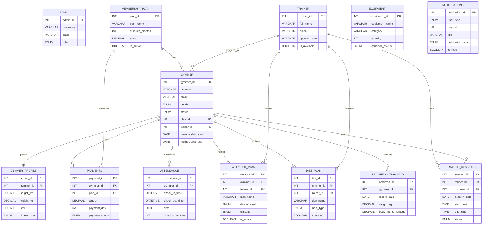

# Gym Management ER Diagram

```mermaid
erDiagram
    ADMIN {
        INT admin_id PK
        VARCHAR username
        VARCHAR email
        ENUM role
    }

    MEMBERSHIP_PLAN {
        INT plan_id PK
        VARCHAR plan_name
        INT duration_months
        DECIMAL price
        BOOLEAN is_active
    }

    TRAINER {
        INT trainer_id PK
        VARCHAR full_name
        VARCHAR email
        VARCHAR specialization
        BOOLEAN is_available
    }

    GYMMER {
        INT gymmer_id PK
        VARCHAR username
        VARCHAR email
        ENUM gender
        ENUM status
        INT plan_id FK
        INT trainer_id FK
        DATE membership_start
        DATE membership_end
    }

    GYMMER_PROFILE {
        INT profile_id PK
        INT gymmer_id FK
        DECIMAL height_cm
        DECIMAL weight_kg
        DECIMAL bmi
        ENUM fitness_goal
    }

    PAYMENTS {
        INT payment_id PK
        INT gymmer_id FK
        INT plan_id FK
        DECIMAL amount
        DATE payment_date
        ENUM payment_status
    }

    ATTENDANCE {
        INT attendance_id PK
        INT gymmer_id FK
        DATETIME check_in_time
        DATETIME check_out_time
        DATE date
        INT duration_minutes
    }

    EQUIPMENT {
        INT equipment_id PK
        VARCHAR equipment_name
        VARCHAR category
        INT quantity
        ENUM condition_status
    }

    WORKOUT_PLAN {
        INT workout_id PK
        INT gymmer_id FK
        INT trainer_id FK
        VARCHAR plan_name
        ENUM day_of_week
        ENUM difficulty
        BOOLEAN is_active
    }

    DIET_PLAN {
        INT diet_id PK
        INT gymmer_id FK
        INT trainer_id FK
        VARCHAR plan_name
        ENUM meal_type
        BOOLEAN is_active
    }

    PROGRESS_TRACKING {
        INT progress_id PK
        INT gymmer_id FK
        DATE record_date
        DECIMAL weight_kg
        DECIMAL body_fat_percentage
    }

    NOTIFICATIONS {
        INT notification_id PK
        ENUM user_type
        INT user_id
        VARCHAR title
        ENUM notification_type
        BOOLEAN is_read
    }

    TRAINING_SESSIONS {
        INT session_id PK
        INT trainer_id FK
        INT gymmer_id FK
        DATE session_date
        TIME start_time
        TIME end_time
        ENUM status
    }

    MEMBERSHIP_PLAN ||--o{ GYMMER : has
    TRAINER ||--o{ GYMMER : assigned_to
    GYMMER ||--|| GYMMER_PROFILE : profile
    GYMMER ||--o{ PAYMENTS : pays
    MEMBERSHIP_PLAN ||--o{ PAYMENTS : billed_for
    GYMMER ||--o{ ATTENDANCE : checks_in
    GYMMER ||--o{ WORKOUT_PLAN : follows
    TRAINER ||--o{ WORKOUT_PLAN : creates
    GYMMER ||--o{ DIET_PLAN : follows
    TRAINER ||--o{ DIET_PLAN : creates
    GYMMER ||--o{ PROGRESS_TRACKING : records
    TRAINER ||--o{ TRAINING_SESSIONS : leads
    GYMMER ||--o{ TRAINING_SESSIONS : attends
```

Notes:
- `NOTIFICATIONS` uses a polymorphic reference (`user_type`, `user_id`) to either `ADMIN` or `GYMMER`.
